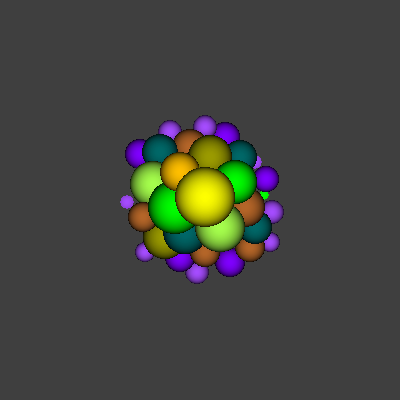

# Raytracer

A simple raytracer written in C++.

## Build

```bash
make CH14S
make MVPS
make HWS
make CH14A
make MVPA
make HWA
```

## Run

```bash
./raytracer
```

## Output

<p align="center">
  
</p>
